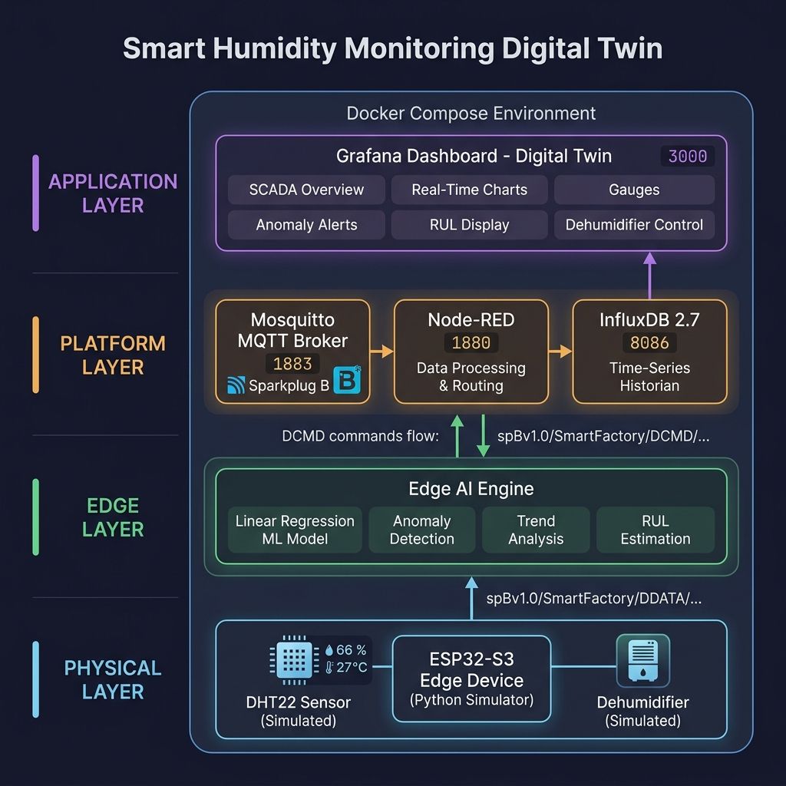

# Smart Humidity Monitoring — Digital Twin

> **CO326 — Computer Systems Engineering: Industrial Networks**  
> **Department of Computer Engineering, University of Peradeniya**

## Group Members

| Name | Registration No. |
|------|------------------|
| *Tharusha Haththella* | *E/20/133* |
| *Sachindu Premasiro* | *E/20/305* |
| *Nimesha Somathilaka* | *E/20/381* |
| *Devin Hasnaka* | *E/20/385* |

## Project Description

This project implements a **Smart Humidity Monitoring Digital Twin** — a complete Edge AI-based Industrial IoT (IIoT) system for real-time humidity monitoring, anomaly detection, and predictive maintenance.

The system follows a **4-layer IIoT architecture** with:
- **Edge AI** for local anomaly detection using Linear Regression
- **MQTT communication** with Sparkplug B Unified Namespace
- **Cloud analytics** for Remaining Useful Life (RUL) estimation
- **Bidirectional Digital Twin** synchronization with actuator control

## System Architecture


<!--
```
┌───────────────────────────────────────────────────────────────────────┐
│                    LAYER 1 — PERCEPTION LAYER                        │
│                                                                       │
│   DHT22 Sensor (simulated)  →  ESP32-S3 (simulated in Python)       │
│   • Humidity & Temperature       • Edge AI: Linear Regression        │
│   • 2-second polling interval    • Anomaly Detection (threshold)     │
│   • Historical CSV dataset       • Trend Analysis                    │
│   (data_3hrs.csv — 5400 pts)     • Feature: 5 humidity + 1 temp lag │
└──────────────────────────┬────────────────────────────────────────────┘
                           │ JSON Payloads
                           ▼
┌───────────────────────────────────────────────────────────────────────┐
│                    LAYER 2 — TRANSPORT LAYER                         │
│                                                                       │
│   Eclipse Mosquitto MQTT Broker (Docker)                             │
│   • Sparkplug B topic structure (UNS)                                │
│   • QoS 1 for reliable delivery                                      │
│   • Last Will & Testament (LWT) for device status                    │
│   • Bidirectional: DDATA (telemetry) + DCMD (commands)               │
└──────────────────────────┬────────────────────────────────────────────┘
                           │ MQTT Messages
                           ▼
┌───────────────────────────────────────────────────────────────────────┐
│                    LAYER 3 — EDGE-LOGIC LAYER                        │
│                                                                       │
│   Node-RED (Docker)                                                   │
│   • MQTT → InfluxDB data pipeline                                    │
│   • RUL Estimation (linear trend on anomaly scores)                  │
│   • Alert routing (WARNING / CRITICAL → dedicated topic)             │
│   • Bidirectional control buttons (Dehumidifier ON/OFF)              │
└──────────────────────────┬────────────────────────────────────────────┘
                           │ Time-Series Data
                           ▼
┌───────────────────────────────────────────────────────────────────────┐
│                    LAYER 4 — APPLICATION LAYER                       │
│                                                                       │
│   InfluxDB 2.7 (Historian)     │   Grafana (SCADA Dashboard)        │
│   • Time-series storage         │   • Live humidity & temp charts    │
│   • Flux query language          │   • ML prediction overlay         │
│   • co326_bucket                 │   • Anomaly score visualization   │
│                                  │   • RUL estimation display        │
│                                  │   • Device status indicator       │
│                                  │   • Dehumidifier control panel    │
└───────────────────────────────────────────────────────────────────────┘
```
-->
## MQTT Topics Used (Unified Namespace — Sparkplug B)

```
spBv1.0/SmartFactory/
├── DDATA/HumidityMonitoring/humidityTwin01          ← Telemetry data (humidity, temp, ML prediction, anomaly)
├── DDATA/HumidityMonitoring/humidityTwin01/anomaly  ← Anomaly alerts (WARNING / CRITICAL only)
├── DDATA/HumidityMonitoring/humidityTwin01/status   ← Device status (ONLINE / OFFLINE via LWT)
├── DDATA/HumidityMonitoring/humidityTwin01/rul      ← Remaining Useful Life estimation
└── DCMD/HumidityMonitoring/humidityTwin01           ← Commands TO device (Dehumidifier ON/OFF)
```

## How to Run

### Prerequisites
- Docker & Docker Compose
- Python 3.8+
- Git

### Step 1 — Start Docker Stack
```bash
cd Docker/co326
docker-compose up -d
```

### Step 2 — Verify Services
```bash
docker-compose ps
```
All 4 services (Mosquitto, InfluxDB, Node-RED, Grafana) should be "Up".

### Step 3 — Install Node-RED InfluxDB Palette
1. Open Node-RED: http://localhost:1880
2. Menu → Manage Palette → Install → Search `node-red-contrib-influxdb` → Install
3. Import flows: Menu → Import → Select `node-red/flows.json` → Import

### Step 4 — Install Python Dependencies
```bash
cd python
pip install -r requirements.txt
```

### Step 5 — Run MQTT Publisher (Edge Simulator)
```bash
python mqtt_publisher.py
```

### Step 6 — View Dashboard
- **Grafana:** http://localhost:3000 (admin / admin)
- **Node-RED:** http://localhost:1880
- **InfluxDB:** http://localhost:8086

### Step 7 — Test Bidirectional Control
In Node-RED, click the "Activate Dehumidifier" inject node to send a command to the edge device.

## Edge AI Model

| Parameter | Value |
|-----------|-------|
| **Algorithm** | Linear Regression |
| **Features** | 5 humidity lags + 1 temperature lag (6 total) |
| **Window Size** | 5 readings |
| **Anomaly Threshold** | 5.0 %RH deviation → CRITICAL |
| **Warning Threshold** | 3.0 %RH deviation → WARNING |
| **MSE** | 2.3402 |

## Cybersecurity Features

- **MQTT LWT:** Auto-publishes OFFLINE status on unexpected disconnect
- **QoS 1:** At-least-once delivery guarantee
- **Timestamped data:** All payloads include ISO 8601 UTC timestamps
- **Structured topics:** No hard-coded device dependencies (UNS pattern)
- **MQTT Auth:** Mosquitto supports password-based authentication (configurable)

## Challenges

1. **C-to-Python migration:** The original sensor simulator was in C; porting to Python enabled direct MQTT publishing without external library compilation
2. **Model accuracy:** Linear Regression provides reasonable predictions but is limited for non-linear patterns
3. **Real-time constraints:** Simulated polling interval (2s) balances demo speed with realistic behavior

## Future Improvements

- [ ] Deploy on real ESP32-S3 with DHT22 sensor
- [ ] Implement TLS encryption for MQTT
- [ ] Add more sophisticated ML models (Random Forest, LSTM)
- [ ] Implement Modbus TCP integration
- [ ] Add email/SMS alerting for CRITICAL events
- [ ] Historical data comparison in Grafana
